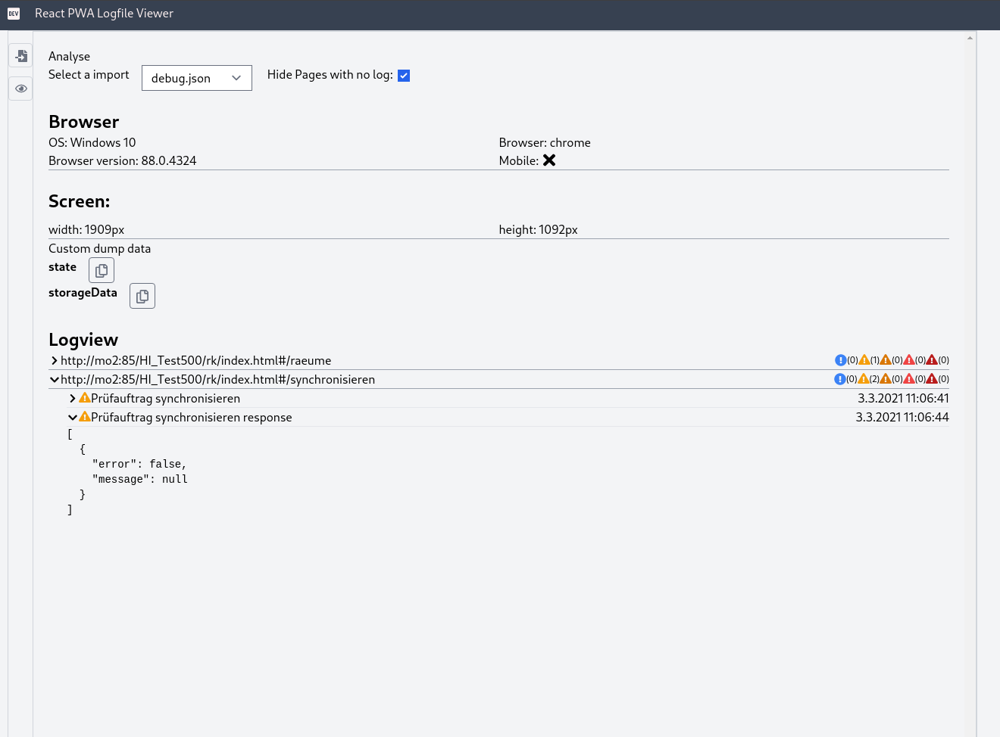

# logger-viewer

## A aplication to visualize the react-pwa-logger dumps

To start enter yarn start

Your browser will start and you see the application. This application needs no backend. Data will stored in a IndexedDb in yout browser. Each log import generates a new database.

## Screenshots

### Home

### Import

### Log view

